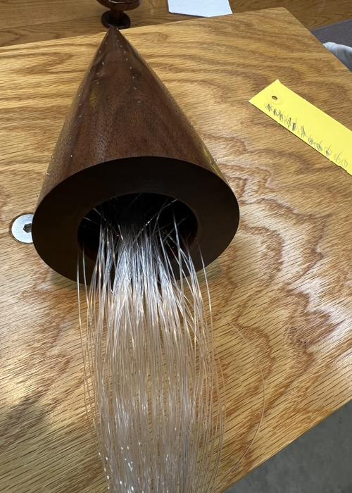

# Overview
The goal of this project is to create a wooden fiber optic christmas tree driven by NeoPixels (WS2812B) individually addressable LEDs.  All of the electronics are housed in the base requiring a minimal footprint within the wooden tree.

The general design is a stacked / layered design where the microprocessor is on one level then the LEDs followed by the fiber optic strangs, all held together with metric screws which allows for additional layers to be added.

 

# Bill Of Materials

Here is the list of material that was used in this project which is basically a microprocessor and RGB LEDs with fiber optic cables:

1. Seeed Studio XIAO SAMD21
2. NeoPixel RGBW Mini Button PCB (Qty: 4)
3. Fiber Optic Cable (0.25mm)

 

# Designing / Prototyping

To design the case, the first step is to determine the appropriate size based on the XIAO processor, which serves as the limiting factor. Since the case will be placed inside a wooden object, making it round is the easiest shape to carve. 

Once the general size is established, the next step is to determine how many NeoPixels can fit around the microprocessor. 

It turns out that four LEDs can fit in a grid with enough space for screws. 

Once the general size of the case is figured out the next step is to figure out how many of the NeoPixels can be placed in the size of the microprocessor which worked out to four LEDs in a grid with enough space for the screws.

After printing out the LED holder layer, the LEDs can be fitted and wired up easily since they are serial devices.

 

# Woodworking

Hollowing out the inside of a fiber optic tree is necessary for running the fibers, which poses a challenge.

# Assembly

# Programming / Configuring

The LED program is based on Adafruit's example code but with adjusted parameters. It required some adjustments to determine an optimal transition speed. Reflashing the microprocessor with new code updates is simple since the tree is powered through the USB-C connector. The tree's appearance improved once color was added, as it was initially only white.

There was some experimenting with a powered base that can be bolted on but having a USB powered tree was preferred.

[Blender File](documents/v2/LED%20Tree.blend)
